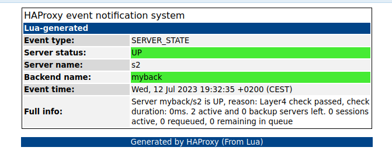
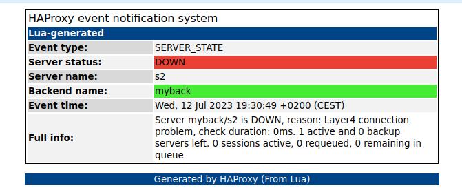

## Howto

Use `docker-compose up` to start the demo

Go to localhost:1080 on your browser to preview emails generated by haproxy.

The dummy socat servers will intentionally flap every 10 seconds to force haproxy to generate new server events.

You can easily customize the `lua_html_email_alerts.lua` script and fire the demo again to test your changes.

## Examples:

